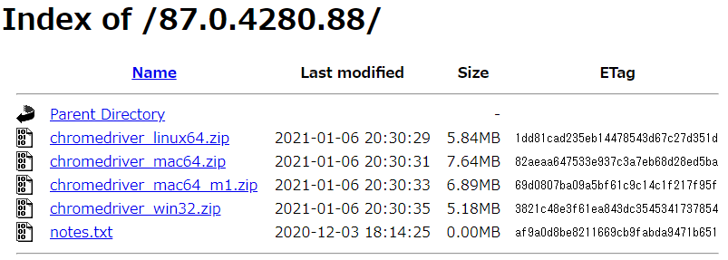

# CentOS7.8 + google Chrome + chromedriver + selenium

## Chrome のインストールと 日本語フォントのインストール

-   google chrome のリポジトリを追加
-   chrome のインストール
-   日本語フォントを追加

```
# cat << EOF > /etc/yum.repos.d/google-chrome.repo
[google-chrome]
name=google-chrome
baseurl=http://dl.google.com/linux/chrome/rpm/stable/$basearch
enabled=1
gpgcheck=1
gpgkey=https://dl-ssl.google.com/linux/linux_signing_key.pub
EOF

# yum install google-chrome-stable
# yum install ipa-gothic-fonts ipa-mincho-fonts ipa-pgothic-fonts ipa-pmincho-fonts
```

## chrome の動作チェック

-   ヘッドレス Chrome ことはじめ<br>
    https://developers.google.com/web/updates/2017/04/headless-chrome?hl=ja

-   問題なくインストールされているかチェックする
-   問題がなければ実行したディレクトリに(http://google.co.jp/)のスクリーンショットが出来上がる

```
$ /opt/google/chrome/chrome --headless --disable-gpu --window-size=1024,768 --hide-scrollbars --screenshot='google.png' https://www.google.co.jp/
```

## chromedriver のインストールと chromedriver の選び方

-   Which ChromeDriver version is compatible with which Chrome Browser version?<br>
    https://stackoverflow.com/questions/41133391/which-chromedriver-version-is-compatible-with-which-chrome-browser-version#:~:text=ChromeDriver%20is%20only%20compatible%20with,a%20Selenium%2Dbacked%20WebDriver%20instance.

-   ChromeDriver - WebDriver for Chrome Version Selection<br>https://sites.google.com/a/chromium.org/chromedriver/downloads/version-selection

### chromedrive の選び方

-   インストールした chrome のバージョンをチェック

```
# /opt/google/chrome/chrome --version
Google Chrome 87.0.4280.141 unknown
```

-   以下の URL の最後に先程のバージョンの最後の数値を削った値を追加する

    -   https://chromedriver.storage.googleapis.com/LATEST_RELEASE_

    -   Google Chrome 87.0.4280.141 → 87.0.4280
    -   https://chromedriver.storage.googleapis.com/LATEST_RELEASE_87.0.4280

-   ブラウザから上記の URL にアクセスすると「87.0.4280.88」という値が返ってくる
-   先程入手した「87.0.4280.88」を利用して以下の URL にアクセスする

    -   https://chromedriver.storage.googleapis.com/index.html?path=87.0.4280.88/

    -   

-   上記の URL から対応するプラットフォームのファイルをダウンロードする

### 適切な chrome と chromedriver の組み合わせができないとき

-   以下の方法で旧バージョンの chrome がダウンロードできる
-   How to download and install chrome browser with specific version in terminal?<br>
    https://unix.stackexchange.com/questions/371981/how-to-download-and-install-chrome-browser-with-specific-version-in-terminal

```
Took a little digging, but just pieced this together:

yum install -y https://dl.google.com/linux/chrome/rpm/stable/x86_64/google-chrome-stable-${GOOGLE_CHROME_VERSION}-1.x86_64.rpm
You can extract available versions from the following URL: https://www.ubuntuupdates.org/package/google_chrome/stable/main/base/google-chrome-stable

Share
Improve this answer
Follow
```
